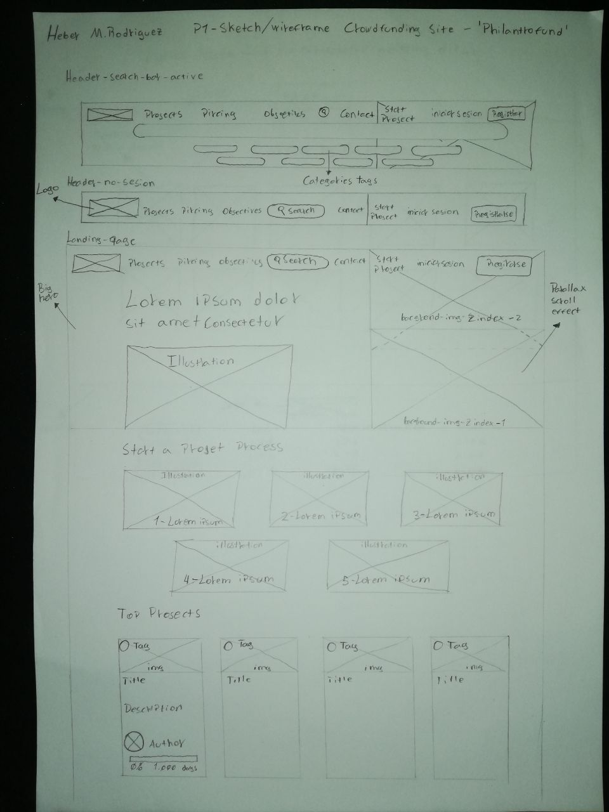
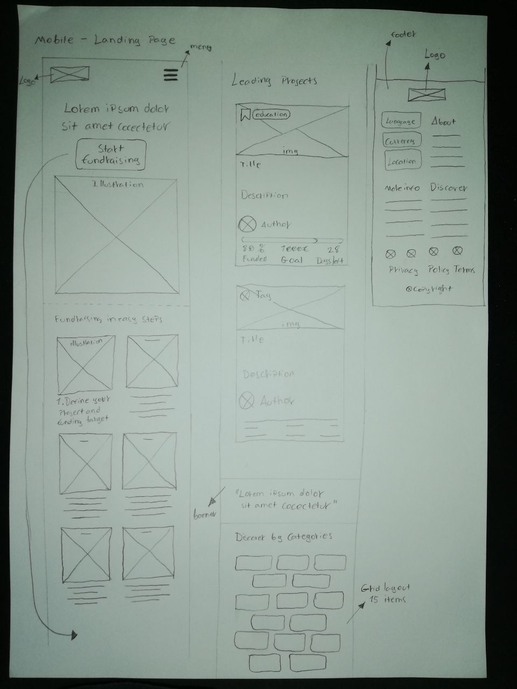
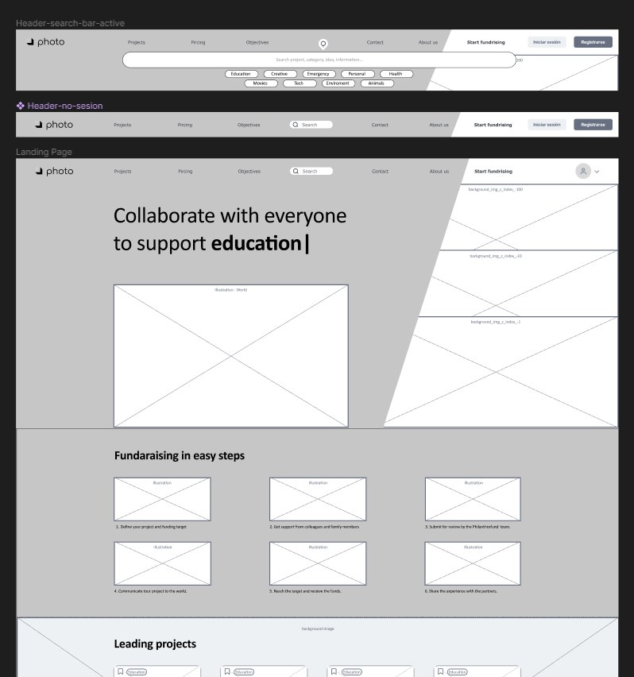
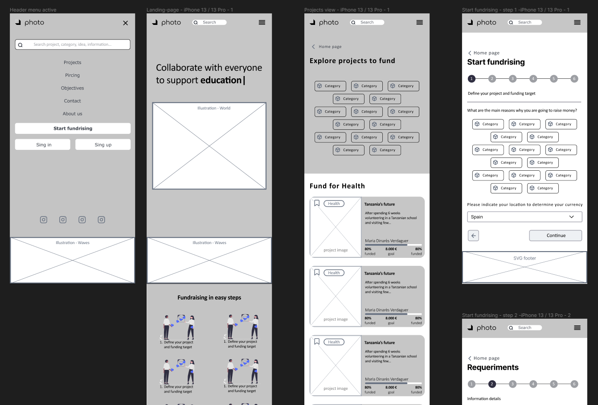

#  DIW-Wireframe

## [Philantrofund Wireframe - Crowdfunding site](https://www.figma.com/file/809IEcC0ygNSTmdcdp8n79/Crowdfunding-site---Wireframe?node-id=71%3A204)

### Práctica 1

En las prácticas de una empresa de mantenimiento de páginas web.
Les ha surgido un cliente nuevo que necesita crear una página para gestionar campañas de ***CrowdFunding***.

El cliente quiere un diseño previo. Demanda que sea similar a las páginas que hay en este sector, como por ejemplo:
[Indiegogo](https://www.indiegogo.com/) y [Kickstarter](https://www.kickstarter.com/)

Los procesos consisten en:
- Crear el *sketch* de las vistas de la aplicación, tanto en vista *desktop* com en vista *mobile*.
- A raíz del *sketch*, hacer un *wireframe* de las vistas, tanto en vista *desktop* como en vista *mobile*.
- Elaborar una guía de estilo.
- Realizar un vídeo explicativo de los conceptos de UX/UI aplicados.

### *Sketch*

 

### *Wireframe*

Header status on landing page.

General mobile views.

### Guía de estilo - Paleta de colores

Muestra - 01

Muestra - 02 & 03

 

### Guía de estilo - Tipografía

### Conceptos de UX/UI aplicados

**Navigation**

La estructura de navegación de la página web es principalmente jerárquica, en la cual el menú principal contiene sus secciones posteriores a excepción del proceso de iniciar recaudación de fondos (Start fundrising) con un proceso secuencial.

- **Main menu**
 
Enlaces a secciones del mismo dominio:

- **Inner links**

Enlaces internos situados en textos/imágenes. Las cartas/fichas de projectos e ilustraciones de categorias son un ejemplo de ello:

 

- **Organizational links**

Etiquetas como enlace y barra de búsqueda, relacionar información al contenido de las etiquetas o la sentencia de la barra de búsqueda:

- **Breadcrumbs**

Indicador de ubicación en los procesos de iniciar una recaudación de fondos (*Start fundrising*) para guiar al usuario.

